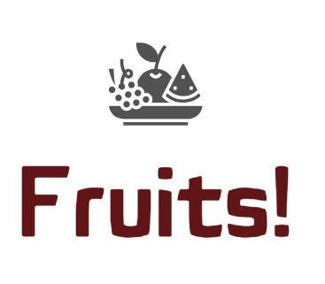

<h1>Projet 8: Déployez un modèle dans le cloud</h1>
  

<h2>Contexte et problématique du projet</h2>

Vous êtes Data Scientist dans une très jeune start-up de l'AgriTech, nommée  "Fruits!", qui cherche à proposer des solutions innovantes pour la récolte des fruits.

Votre start-up souhaite dans un premier temps se faire connaître en mettant à disposition du grand public une application mobile qui permettrait aux utilisateurs de prendre en photo un fruit et d'obtenir des informations sur ce fruit.

Pour la start-up, cette application permettrait de sensibiliser le grand public à la biodiversité des fruits et de mettre en place une première version du moteur de classification des images de fruits.

De plus, le développement de l’application mobile permettra de construire une première version de l'architecture Big Data nécessaire.

<h2>But et intérêt du projet</h2>

Développement, dans un environnement Big Data, d'une première chaîne de traitement des données, à partir des données suivantes : https://www.kaggle.com/moltean/fruits

- Réalisation d'une chaîne de traitement des données avec preprocessing et reéduction de PCA.
- Mise en oeuvre de calculs distribués en Apache Spark (Pyspark) pour traitement des images (extraction des images, resizing, extraction des features) à l'aide de dataframe Spark.
- Mise en oeuvre d'une métrique personnalisée sous la forme d'un fonction de revenu net.
- Mise en place d'une architecture AWS Big Data permettant le scaling (IAM pour la sécurité et les autorisationns, pour le stockage des images, Sagemaker pour la Machine Learning).

<h2>Compétences évaluées</h2>

- Paralléliser des opérations de calcul avec Pyspark
- Utiliser les outils du cloud pour manipuler des données dans un environnement Big Data
- Identifier les outils du cloud permettant de mettre en place un environnement Big Data

<h2>Contenu du dépôt GitHub</h2>

- README.md: fichier présentation projet

- fruits.jpg : image illustration README.md

- Répertoire "Notebooks": 
  - fichier "P8_01_OC_DS.ipynb": fichier notebook Jupyter en Python pour le  
  - Répertoire "P8_04_images": ensemble des images de l'échantillon classées par catégorie 
  
- Répertoire "Resultat_matrice":
  - fichier "P8_03_result_with_pca.csv": fichier résultat avec réduction dimensions au format csv 
    
- Répertoire "Soutenance":
  - fichier "P8_02_soutenance_projet_ppt.ppt": fichier support soutenance projet Powerpoint
  - fichier "P8_02_soutenance_projet_pdf.pdf": fichier support soutenance projet PDF
  - fichier "projet_p8_oc_ds.mp4": video soutenance projet P8 (mp4)
  - fichier "Projet 8 valide - Déployez un modèle dans le cloud - OC.pdf": preuve de validation du projet P8